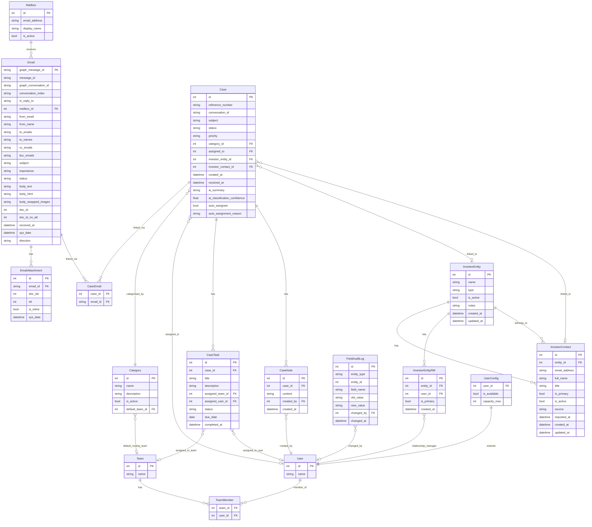

# Data Model

Canonical ERD for the Investor Query Hub. Update this page whenever the data model changes.

---

---

## Entity reference

### Mailbox
| Field | Type | Notes |
|---|---|---|
| id | int | PK |
| email_address | string | The monitored mailbox address |
| display_name | string | Human-readable label |
| is_active | bool | Inactive mailboxes are skipped in polling |

### Email
*Source: `APP_MAIL_POLLER` (MySQL_DDLs.sql)*

| Field | Type | Notes |
|---|---|---|
| graph_message_id | string | PK — Graph API message ID (`MESSAGE_GRAPH_ID`), immutable |
| message_id | string | SMTP Message-ID header (`MESSAGE_ID`), unique — fallback dedup key |
| graph_conversation_id | string | Thread key — used to link emails to a Case (`CONVERSATION_ID` in v4.3.0 DDL) |
| conversation_index | string | Base64 `conversationIndex` MIME header — encodes message position in thread tree; used by Outlook for fine-grained threading (`CONVERSATION_INDEX`, added v4.3.0) |
| in_reply_to | string | SMTP In-Reply-To header — secondary threading signal |
| mailbox_id | int | FK → Mailbox |
| from_email | string | Sender address |
| from_name | string | Sender display name |
| to_emails | string | To addresses |
| to_names | string | To display names |
| cc_emails | string | CC addresses |
| bcc_emails | string | BCC addresses |
| subject | string | |
| importance | string | Email importance flag from Graph (`low` `normal` `high`) |
| status | string | Processing status (internal) |
| body_text | string | Plain text body |
| body_html | string | Raw HTML body, immutable after ingest |
| body_swapped_images | string | HTML with inline images replaced by Appian doc references |
| doc_id | int | Appian document ID — full email including attachments |
| doc_id_no_att | int | Appian document ID — email without attachments |
| received_at | datetime | When email was received |
| sys_date | datetime | When record was created (polled) |
| direction | string | `INBOUND` or `OUTBOUND` |

### EmailAttachment
*Source: `APP_MAIL_POLLER_DOC` (MySQL_DDLs.sql)*

| Field | Type | Notes |
|---|---|---|
| id | int | PK |
| email_id | string | FK → Email.graph_message_id |
| doc_idx | int | Appian document ID for the attachment |
| elt | int | Element index (position in the email's attachment list) |
| is_inline | bool | True if the attachment is an inline image (embedded in body) |
| sys_date | datetime | When record was created |

### Case
| Field | Type | Notes |
|---|---|---|
| id | int | PK |
| reference_number | string | `IQ-YYYY-NNNNN` — generated via Appian sequence |
| conversation_id | string | Matches `Email.graph_conversation_id` — thread key |
| subject | string | |
| status | string | `OPEN` `IN_PROGRESS` `PENDING` `RESOLVED` `CLOSED` |
| priority | string | `LOW` `MEDIUM` `HIGH` `URGENT` — LLM-assigned, overridable |
| category_id | int | FK → Category |
| assigned_to | int | FK → User — nullable (unassigned) |
| investor_entity_id | int | FK → InvestorEntity — nullable; resolved on case creation if sender email matches a known `InvestorContact`. See [[investor-profile]]. |
| investor_contact_id | int | FK → InvestorContact — nullable; same resolution logic. |
| created_at | datetime | |
| resolved_at | datetime | Set when status → `RESOLVED` |
| ai_summary | string | LLM-generated on case creation |
| ai_classification_confidence | float | Stored for audit; 0.0–1.0 |
| auto_assigned | bool | True if assigned by auto-assignment process model. Default false. |
| auto_assignment_reason | string | `LP_RELATIONSHIP` \| `CATEGORY_ROUTING` \| `FALLBACK_UNASSIGNED` \| null. See [[auto-assignment]]. |

### CaseEmail *(join)*
| Field | Type | Notes |
|---|---|---|
| case_id | int | FK → Case |
| email_id | string | FK → Email.graph_message_id |

Ordered by `Email.received_at` when displayed.

### CaseTask
| Field | Type | Notes |
|---|---|---|
| id | int | PK |
| case_id | int | FK → Case |
| title | string | |
| description | string | |
| assigned_team_id | int | FK → Team — nullable |
| assigned_user_id | int | FK → User — nullable |
| status | string | `TODO` `IN_PROGRESS` `DONE` |
| due_date | date | |
| completed_at | datetime | Set when status → `DONE` |

### CaseNote
| Field | Type | Notes |
|---|---|---|
| id | int | PK |
| case_id | int | FK → Case |
| content | string | Internal only — not sent to investor |
| created_by | int | FK → User |
| created_at | datetime | |

### Category
| Field | Type | Notes |
|---|---|---|
| id | int | PK |
| name | string | |
| description | string | Included in AI classification prompt |
| is_active | bool | Inactive categories excluded from AI prompt and filters |
| default_team_id | int | FK → Team — nullable. Default team for auto-assignment routing. See [[auto-assignment]]. |

### Team
| Field | Type | Notes |
|---|---|---|
| id | int | PK |
| name | string | |

### TeamMember *(join)*
| Field | Type | Notes |
|---|---|---|
| team_id | int | FK → Team |
| user_id | int | FK → User |

### User
| Field | Type | Notes |
|---|---|---|
| id | int | PK |
| name | string | Appian native user — managed by Appian, not custom |

### InvestorEntity
*Added for [[investor-profile]]*

| Field | Type | Notes |
|---|---|---|
| id | int | PK |
| name | string | LP firm / fund entity name |
| type | string | `PENSION_FUND` `FAMILY_OFFICE` `ENDOWMENT` `SOVEREIGN_WEALTH` `FUND_OF_FUNDS` `INSURANCE` `OTHER` |
| is_active | bool | Inactive entities excluded from auto-assign lookup and filters |
| notes | string | Internal free-text notes; not shown to investors |
| created_at | datetime | |
| updated_at | datetime | |

### InvestorEntityRM *(join)*
*Added for [[investor-profile]]*

Maps relationship managers to an investor entity. Multiple RMs per entity supported.

| Field | Type | Notes |
|---|---|---|
| id | int | PK |
| entity_id | int | FK → InvestorEntity |
| user_id | int | FK → User — the RM |
| is_primary | bool | True = primary RM for this entity. Exactly one per entity enforced in app logic. |
| created_at | datetime | |

### InvestorContact
*Originally added for [[auto-assignment]]; refactored for [[investor-profile]]*

> ⚠ Breaking change: `entity_name` and `assigned_user_id` removed. Contact is now linked to `InvestorEntity` via `entity_id`; RM held at entity level via `InvestorEntityRM`.

| Field | Type | Notes |
|---|---|---|
| id | int | PK |
| entity_id | int | FK → InvestorEntity |
| email_address | string | Individual's email — exact-match key for ingest resolution and Rule 1 auto-assign |
| full_name | string | Display name |
| title | string | Job title (e.g. CFO, Finance Director) — optional |
| is_primary | bool | True = primary contact for this entity (one per entity, by convention) |
| is_active | bool | Inactive entries ignored during ingest resolution and auto-assign |
| source | string | `MANUAL` or `CRM_IMPORT` |
| imported_at | datetime | Set on CRM import; null if manually created |
| created_at | datetime | |
| updated_at | datetime | |

### UserConfig
*Added for [[auto-assignment]]*

One record per user; absent record = use system defaults.

| Field | Type | Notes |
|---|---|---|
| user_id | int | FK → User (unique) |
| is_available | bool | False = excluded from all auto-assign rules (e.g. OOO). Default true. |
| capacity_max | int | Max open cases before excluded. Null = use `IQH_Constant_CapacityDefaultMax`. |

### FieldAuditLog
| Field | Type | Notes |
|---|---|---|
| id | int | PK |
| entity_type | string | e.g. `"Case"`, `"CaseTask"` |
| entity_id | int | ID of the changed record |
| field_name | string | e.g. `"assigned_to"`, `"status"` |
| old_value | string | Serialised previous value |
| new_value | string | Serialised new value |
| changed_by | int | FK → User — nullable; null = system actor (`IQH_SystemUser`) |
| changed_at | datetime | |
