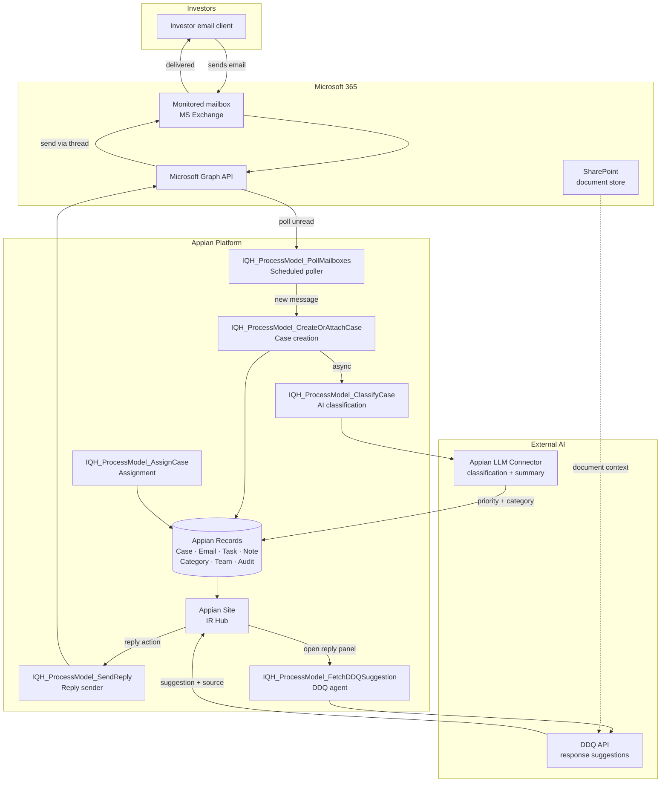

# System Design

High-level architecture of the Investor Query Hub. Update this page when integration points or major structural decisions change.

---

## Component overview



---

## Technology stack

| Layer | Technology | Notes |
|---|---|---|
| Platform | Appian (cloud) | All process models, records, interfaces, and sites |
| Data | Appian native records | No external database; Appian manages persistence |
| Email integration | Microsoft Graph API | OAuth 2.0 client credentials; polling + send |
| Document context | SharePoint via MS Graph | Source documents for DDQ Agent |
| AI — classification | Appian OOTB LLM Connector | Auto-priority and category on case creation |
| AI — response | DDQ API (external) | Suggests replies with source citation |
| Search | Appian Semantic Search | Cross-case search; no external infra needed |
| Reporting | Appian native dashboards | Manager dashboard; record-backed queries |

---

## Integration points

### Microsoft Graph API
- **Auth**: OAuth 2.0 client credentials flow. Token managed by `IQH_CS_MicrosoftGraph` connected system.
- **Polling**: `GET /v1.0/users/{mailbox}/messages?$filter=isRead eq false` — scheduled, marks read after ingest.
- **Reply**: `POST /v1.0/users/{mailbox}/messages/{id}/reply` — preserves `conversationId` for threading.
- **Scope**: `Mail.Read`, `Mail.Send` per mailbox.

### Appian LLM Connector
- **Trigger**: Async after case creation.
- **Input**: Email subject + body (truncated 1500 chars) + active Category list.
- **Output**: `priority`, `category_id`, `confidence`.
- **Fallback**: If unparseable or confidence < threshold, defaults applied; case not failed.

### DDQ API
- **Trigger**: When reply panel is opened on a case.
- **Input**: Investor query text + case reference.
- **Output**: `suggested_reply`, `source` (document, section, URL), `confidence`.
- **Auth**: TBD (API key or OAuth — to be confirmed with DDQ API provider).
- **Safety**: Suggestion pre-populates reply panel; worker must explicitly send — no auto-send.

---

## Appian site structure

```
IQH Site
  ├── My Queue          ← Case worker default landing page
  ├── All Cases         ← Manager view; filtered case list
  ├── Search            ← Semantic search across all cases
  ├── Manager Dashboard ← Managers only
  └── Admin             ← Admins only
```

---

## Security model

| Role | Access |
|---|---|
| Case Worker | Own assigned cases + unassigned queue. Cannot see other workers' cases. |
| Manager | All cases, all workers' queues, manager dashboard. Can reassign any case. |
| Admin | Admin screen (categories, teams, mailboxes, settings). Read access to all cases. |

- Row-level security enforced at the `IQH_Record_Case` level.
- Role membership managed via Appian Groups: `IQH_Group_CaseWorkers`, `IQH_Group_Managers`, `IQH_Group_Admins`.

---

## Key conventions

- All Appian objects prefixed `IQH_`.
- One process model per major workflow — no monolithic processes.
- All MS Graph calls wrapped in try/catch; failures logged to `IQH_ErrorLog`.
- All config values (polling interval, model name, thresholds) stored as Appian constants — never hardcoded.
- Process-driven field changes attributed to `IQH_SystemUser` in `FieldAuditLog`.

---

## Open questions

- DDQ API authentication method — to be confirmed with provider.
- SharePoint integration scope — is document retrieval handled by the DDQ API, or does Appian call Graph directly?
